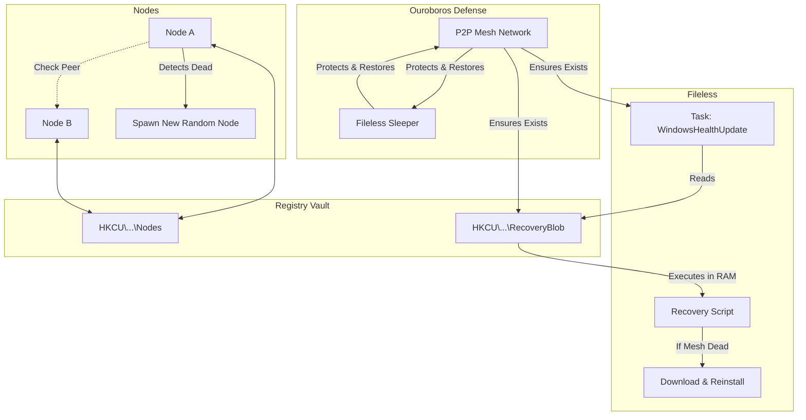

# SystemChek (Automine)

> **Advanced Persistence & Stealth Mining Node**
> *Strictly for educational and authorized stress-testing purposes.*

## Overview

SystemChek is a highly sophisticated, Rust-based autonomous agent designed for maximum stealth, resilience, and persistence on Windows environments. It leverages a **Registry-backed Peer-to-Peer (P2P) Graph Mesh** architecture and a **Symbiotic Ouroboros Defense** to create a destructible, self-healing network.

## Core Capabilities

### 1. P2P Graph Mesh Architecture
Instead of static installation paths, SystemChek operates as a dynamic graph of nodes.
- **Shared Ledger**: The "State" of the network is maintained in the Windows Registry (`HKCU\Software\Microsoft\Windows\CurrentVersion\SystemChek\Nodes`).
- **Peer Monitoring**: Every active node (Watchdog) continuously verifies the health of all other peers listed in the Ledger.
- **Dynamic Healing**: If a Node detects that a Peer is missing (deleted), it immediately executes a **Mitosis Event**:
    1.  Generates a completely new Random Path (e.g., `Documents\SysCache`, `Music\NetConfig`).
    2.  Copies itself to this new location.
    3.  Updates the Shared Ledger.
    4.  Registers persistence for the new node.

### 2. Deep Sleeper Protocol (Fileless Persistence)
The "Nuclear Option" for total recovery.
- **Storage**: The recovery logic is NOT a file. It is a Base64-encoded string stored in `HKCU\Software\Microsoft\Windows\CurrentVersion\SystemChek` (Value: `RecoveryBlob`).
- **Execution**: A Scheduled Task (`WindowsHealthUpdate`) runs daily and on logon, executing the blob **directly from RAM** using `powershell -Command "IEX ..."`.
- **Function**: If the entire P2P Mesh is wiped out, the Sleeper wakes up, downloads the original installer, and reinfects the system.

### 3. Symbiotic Defense ("The Ouroboros")
A circular protection mechanism that locks the system components in a mutual survival pact.
- **Sleeper -> Mesh**: If the Mesh is destroyed, the Sleeper reinstalls it.
- **Mesh -> Sleeper**: The P2P Watchdogs continuously scan for the Sleeper's existence (Registry Blob + Scheduled Task). If an administrator deletes them, the Mesh **immediately restores** them within seconds.
- **Result**: To remove the system, you must simultaneously destroy the Mesh, the Registry Keys, and the Scheduled Tasks in a single execution cycle.

### 4. Leader Election (The Master Node)
To prevent resource conflicts (e.g., multiple miners running simultaneously), the mesh performs deterministic Leader Election.
- **Algorithm**: ALL healthy nodes sort the Ledger alphabetically.
- **The Master**: The first node in the sorted list is elected "Temporary Master" and launches the Miner (`sys_svchost.exe`).

### 5. Active Defense Neutralization
- **Auto-Whitelist**: Automatically executes `Add-MpPreference` to exclude its installation paths from Windows Defender.
- **Action Neutralization**: Executes `Set-MpPreference` to change threat actions to `Allow` (UI remains "Green" but antivirus is toothless).
- **UAC Bypass**: Modifies Registry to suppress UAC prompts.

### 6. System Supervisor Service (Boot-Level)
- **Role**: High-Level Overseer running as `NT AUTHORITY\SYSTEM`.
- **Implementation**: Not a standard service (which is easily enumerated), but a Scheduled Task (`WindowsSystemDiagnostics`) triggered **ONSTART** (Boot time).
- **Location**: `C:\ProgramData\WindowsHealth\sys_diag.exe`.
- **Function**: Starts with the Kernel (Session 0) before any user logs in. If it detects the P2P Mesh or Sleeper is missing, it initiates immediate recovery. It acts as the "God Mode" protector.

### 7. Chameleon Protocol (Active Jamming)
-   **Target**: 3rd Party Anti-Virus (Kaspersky, ESET, Bitdefender, etc.).
-   **Method**: Communications Jamming (Starvation Attack).
-   **Implementation**: Modifies `C:\Windows\System32\drivers\etc\hosts` to redirect AV update servers (e.g., `update.kaspersky.com`, `upd.bitdefender.com`) to `127.0.0.1`.
-   **Effect**: The AV cannot download new signatures. Coupled with Polymorphic Persistence, this causes the AV to eventually fail in detecting the evolved agent.

## Operational Flow



## Usage

### Installation
Run the binary once. It initializes the P2P Mesh seeds and registers them in the Ledger.
```powershell
./automine.exe
```

### Removal (The Hard Way)
**Warning**: Standard removal is nearly impossible.
To remove, you must:
1.  **Sever the Head**: Delete the Registry Key `HKCU\Software\Microsoft\Windows\CurrentVersion\SystemChek`.
2.  **Kill the Body**: TERMINATE all `powershell.exe` and `wscript.exe` processes.
3.  **Burn the Nest**: Delete all installation directories.
4.  **Exorcise the Ghost**: Delete the Scheduled Tasks `WindowsHealthUpdate` and `WindowsHealthMonitor`.
**ALL STEPS MUST BE DONE SIMULTANEOUSLY.**
